# Welcome to the ENIAD Agile Scrum Delivery & Machine Learning Service Documentation Wiki 📖

Welcome to the official technical documentation and engineering reference for **ENIAD Agile Scrum Delivery & Machine Learning Service**.

---

## 🎯 Academic & Technical Mission

End-to-End Scrum Engineering Framework with Sprint Ceremonies, Product Backlog Management, User Stories, and Operational Machine Learning Classification Web Service.

Developed within the **State Engineering Degree in Artificial Intelligence & Digital Systems** at the **École Nationale d'Intelligence Artificielle et du Digital (ENIAD)**, Berkane, Morocco.

---

## 📚 Wiki Documentation Chapters

| Chapter | Description | Primary Topics |
| :--- | :--- | :--- |
| **[[Architecture]]** | Deep architectural design & component topology | Mermaid diagrams, component interactions, runtime environment |
| **[[Getting-Started]]** | Developer setup & workstation configuration | Prerequisites, toolchain setup, execution commands |
| **[[Curriculum-Guide]]** | Detailed syllabus and laboratory breakdown | Lab objectives, expected outputs, deliverables |

---

## 🏛️ System Architecture Snapshot

```mermaid
graph LR
    A[Product Backlog] --> B[Sprint Planning]
    B --> C[Sprint Backlog]
    C --> D[Daily Scrum & Development]
    D --> E[Working ML Classifier Pipeline]
    E --> F[Interactive Web Microservice]
    F --> G[Sprint Review & Retrospective]
    style A fill:#00D9FF,stroke:#333,stroke-width:1px,color:#000
    style D fill:#FF6B00,stroke:#333,stroke-width:1px,color:#fff
    style E fill:#3C873A,stroke:#333,stroke-width:1px,color:#fff
    style F fill:#7928CA,stroke:#333,stroke-width:1px,color:#fff

```

---

## 🏉 Scrum Framework Implementation

- **Roles**: Product Owner (PO), Scrum Master (SM), Development Team.
- **Ceremonies**:
  1. Sprint Planning (defining Sprint Goal, committing to backlog items)
  2. Daily Standup (synchronization, impediment identification)
  3. Sprint Review (demo of working classification web service)
  4. Sprint Retrospective (continuous improvement actions)
- **Definition of Done (DoD)**:
  - Code reviewed and formatted
  - Unit and integration tests passing
  - Model cross-validation accuracy exceeding baseline threshold
  - Documentation and API endpoints validated

---

*Maintained with ❤️ by [Oussama EL HADJI](https://github.com/Bosaj) • ENIAD Berkane*
